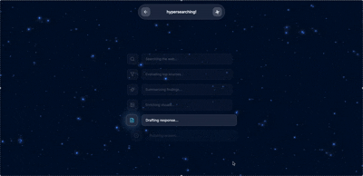

## HyperSearch Experience & UI Storytelling

### Feature Walkthrough

The UI is built as a cinematic journey from the landing screen to the final answer. Each stage is captured in a short demo so you can feel the flow in motion:

- **Home screen launch** – A glassmorphic welcome panel floats over a cosmic gradient while the search bar invites the user to “jump to hyperspace.” The `Home_Screen_AI_Search.gif` loop shows how the hero CTA, ambient particle field, and subtle parallax cues set the tone for exploration.
  
  
- **Hyper-search in motion** – Triggering a query kicks off the hyper-search animation (`Searching_Process.gif`). Concentric light trails, animated progress glyphs, and stage-by-stage copy reinforce that the agent is traversing knowledge galaxies in real time.
- 
  

- **Results constellation** – The results view (`Result_View.gif`) is organized as a control deck:
  
  
  - A succinct **summary module** anchors the page so you grok the answer instantly.
  - Responsive **image tiles** keep the visuals fresh even when upstream SERP data is sparse.
  - **Cited sources** are rendered as interactive cards with inline links, making it obvious where every fact originated.
  - The **“Steps the LLM took”** drawer surfaces the internal chain-of-thought so users understand how the answer was assembled.
  - **Similar questions** appear as tappable chips; selecting one relaunches the search flow without ever feeling like you left the cockpit.

### Design Intent

The interface leans heavily into the “Fleetline” narrative: searching the web should feel like navigating hyperspace in Star Wars. To sell that story:

- **Sequential journey** – Every screen transition mirrors a leg of a mission: takeoff (home), warp (hyper-search), arrival (results). The user never sees a jarring jump; instead, they glide through stages that visually rhyme.
- **Color with restraint** – A limited palette of neons and deep-space gradients keeps the layout minimal while still delivering bold moments of color. Animated light sweeps add warmth without overwhelming the content.
- **Glassmorphism everywhere** – Frosted surfaces, bloom, and soft shadows echo modern sci-fi HUDs. Pairing glass panels with motion-heavy backgrounds creates depth and makes the data feel holographic.
- **Motion as feedback** – Micro-animations (button pulses, shimmer accents, orbiting icons) explain what’s happening behind the scenes, helping the user trust the agent during longer searches.

Together, these decisions make the experience feel less like a web app and more like a narrated voyage through space and time—exactly the sensation the project set out to achieve.

## Backend Table of Contents

1. [API Design](#api-design)
2. [System Design](#system-design)
3. [Data Modeling](#data-modeling)
4. [LangGraph Agent Structure](#langgraph-agent-structure)
5. [Architectural Tradeoffs](#architectural-tradeoffs)
6. [How to Run](#how-to-run)

---

## API Design

### Endpoints

#### `POST /api/ask`
Main endpoint for processing user queries through the agent pipeline.

**Request:**
```json
{
  "session_id": "abc123",
  "query": "What are the latest developments in AI?"
}
```

**Response:**
```json
{
  "session_id": "abc123",
  "question": "What are the latest developments in AI?",
  "overview": "Recent AI developments include... [1][2]",
  "overview_image": "https://example.com/image.jpg",
  "topics": [
    {
      "title": "Large Language Models",
      "content": "LLMs have advanced significantly... [1]"
    },
    {
      "title": "AI Regulation",
      "content": "Governments are implementing... [2]"
    }
  ],
  "sources": [
    {
      "id": 1,
      "title": "Tech News Article",
      "url": "https://example.com/article",
      "image": null,
      "extended_snippet": "Full article snippet..."
    }
  ],
  "timestamp": "2025-01-15T10:30:00Z"
}
```

**Features:**
- Session-based conversation continuity via checkpoints
- Automatic state persistence after each request
- Graceful error handling with detailed error messages
- Input validation for empty queries and session IDs

#### `GET /health`
Simple health check endpoint for service monitoring.

**Response:**
```json
{
  "status": "ok"
}
```

### API Design Principles

1. **Stateless with Session Persistence**: While the API itself is stateless, session state is maintained via disk-based checkpoints, enabling conversational context across requests.
2. **Structured Error Responses**: All errors return appropriate HTTP status codes (422 for validation, 500 for server errors) with descriptive messages.
3. **Backward Compatibility**: The API supports both `answer` (legacy) and `overview` (current) fields, with automatic migration.
4. **Type Safety**: Uses Pydantic models for request/response validation and serialization.

---

## System Design

### High-Level Architecture

```
┌─────────────┐
│   Client    │
│  (Frontend) │
└──────┬──────┘
       │ HTTP/REST
       │
┌──────▼─────────────────────────────────────┐
│         FastAPI Application                │
│  ┌──────────────────────────────────────┐  │
│  │  POST /api/ask                       │  │
│  │  - Load/Initialize State             │  │
│  │  - Invoke LangGraph                  │  │
│  │  - Persist Checkpoint                │  │
│  │  - Return Response                   │  │
│  └──────────────┬───────────────────────┘  │
└─────────────────┼──────────────────────────┘
                  │
        ┌─────────▼─────────┐
        │   LangGraph Agent │
        └─────────┬─────────┘
                  │
    ┌─────────────┼─────────────┐
    │             │             │
┌───▼────┐  ┌─────▼──────┐  ┌──▼─────┐
│BrightData│  │  OpenAI   │  │ Check- │
│  SERP    │  │   LLM     │  │ points │
│  API     │  │           │  │  & Logs│
└─────────┘  └───────────┘  └────────┘
```

### Component Responsibilities

1. **FastAPI Application** (`app/api/main.py`)
   - Request/response handling
   - Session management
   - Checkpoint loading/saving
   - Error handling and validation

2. **LangGraph Agent** (`app/agent/graph.py`)
   - Workflow orchestration
   - State management through pipeline
   - Node execution coordination

3. **External Services**
   - **BrightData SERP API**: Web search results with rich metadata
   - **OpenAI API**: LLM-based synthesis and content generation

4. **Persistence Layer**
   - **Checkpoints**: Disk-based state persistence (`.pkl` files)
   - **Logs**: JSONL-structured event logs for debugging and monitoring

### Configuration Management

All configuration is centralized in `app/config.py`:
- Environment variable loading via `python-dotenv`
- Automatic directory creation for data storage
- Default values for optional settings
- Type-safe configuration access

---

## Data Modeling

### Core Models

#### `AgentState`
The central state object that flows through the LangGraph pipeline:

```python
class AgentState(BaseModel):
    session_id: str
    query: str
    history: list[dict[str, Any]]  # Conversation history
    results: list[SearchResult] | None
    answer: str | None  # Legacy field (kept for compatibility)
    overview: str | None  # Main comprehensive answer
    overview_image: str | None  # Single image URL from SERP
    topics: list[dict[str, str]] | None  # [{"title": "...", "content": "..."}]
    citations: list[Citation] | None
    final_payload: dict | None  # Final API response structure
```

**Design Decisions:**
- **Immutable State Updates**: Each node returns a new/modified state object
- **Conversation History**: Maintains full conversation context for multi-turn interactions
- **Backward Compatibility**: Both `answer` and `overview` fields supported during migration

#### `SearchResult`
Rich search result model from BrightData SERP API:

```python
class SearchResult(BaseModel):
    title: str
    url: str
    snippet: str  # Primary snippet
    domain: str
    extended_snippet: str | None  # Longer description
    snippet_highlighted: list[str] | None  # Highlighted keywords
    position: int | None  # Search ranking
    date: str | None  # Publication date
    cite: str | None  # Citation format
    thumbnail: str | None  # Preview image URL
    breadcrumb: str | None  # Site navigation path
    keywords: list[str] | None  # Topic keywords
    cached_link: str | None  # Google cached page link
```

**Benefits:**
- Rich metadata enables better context for LLM synthesis
- Extended snippets provide more comprehensive information
- Keywords and dates help with relevance and recency

#### `Citation`
Citation model for source attribution:

```python
class Citation(BaseModel):
    id: int  # Citation number for [1], [2], etc.
    title: str
    url: str
    image: str | None
    extended_snippet: str | None  # Rich context from search results
```

---

## LangGraph Agent Structure

### Workflow Overview

The agent follows a linear pipeline architecture. Note: The `prioritize` node exists in the codebase but is not currently used in the workflow (search results go directly to synthesis for performance).

```
┌─────────┐
│  START  │
└────┬────┘
     │
     ▼
┌──────────┐
│  search  │  • Queries BrightData SERP API
│          │  • Extracts up to 10 organic results
│          │  • Extracts overview_image from SERP
└────┬─────┘
     │
     ▼
┌─────────────┐
│ synthesize  │  • Uses OpenAI LLM to synthesize answer
│             │  • Generates overview + 2 topics
│             │  • Creates citations with inline [1][2]
└────┬────────┘
     │
     ▼
┌──────────────┐
│enrich_images │  • Passthrough (image from SERP)
│              │  • Kept for backward compatibility
└────┬─────────┘
     │
     ▼
┌──────────────┐
│format_output │  • Builds final API payload
│              │  • Adds timestamp
│              │  • Saves to conversation history
└────┬─────────┘
     │
     ▼
┌───────┐
│  END  │
└───────┘
```

### Node Details

#### 1. `search` Node
**File:** `app/agent/nodes/search.py`

**Responsibilities:**
- Queries BrightData SERP API with user query
- Parses organic search results (up to 10)
- Extracts overview image from SERP response (priority: knowledge_graph > images > top result thumbnail)
- Enriches results with extended metadata (snippets, keywords, dates)

**Optimizations:**
- Uses `parsed_light` format for 2x faster response times
- Extracts images directly from SERP (no additional scraping needed)

#### 2. `synthesize` Node
**File:** `app/agent/nodes/synthesize.py`

**Responsibilities:**
- Takes top 5 search results for synthesis
- Builds context from conversation history
- Calls OpenAI LLM with structured prompt
- Parses JSON response: `{overview, topics, citations}`
- Maps citations back to search results for extended snippets

**Prompt Strategy:**
- Comprehensive overview with inline citations
- 2 distinct topics that expand on the overview
- Strict JSON output format for reliability

#### 3. `enrich_images` Node
**File:** `app/agent/nodes/enrich_images.py`

**Current Implementation:**
- Simplified passthrough (images extracted in search node)
- Kept for backward compatibility and potential future enhancements

**Rationale:**
- BrightData SERP API provides images directly
- Eliminates need for additional HTTP scraping
- Reduces latency by ~15-20 seconds per request

#### 4. `format_output` Node
**File:** `app/agent/nodes/format_output.py`

**Responsibilities:**
- Constructs final API response payload
- Adds UTC timestamp
- Appends assistant response to conversation history
- Handles fallback scenarios gracefully

### State Flow

State flows through the pipeline as follows:

1. **Initialization**: `AgentState` created with `session_id`, `query`, and initial `history`
2. **Search**: `results` populated, `overview_image` extracted
3. **Synthesize**: `overview`, `topics`, `citations` generated
4. **Enrich Images**: Passthrough (no modifications)
5. **Format Output**: `final_payload` constructed, `history` updated

---

## Architectural Tradeoffs

### 1. Checkpoint Persistence vs. Database

**Decision:** File-based checkpoints (`.pkl` files) instead of database

**Tradeoffs:**
- ✅ **Pros:**
  - Simple implementation, no database setup required
  - Fast local I/O for development
  - Easy to inspect/debug (pickle files)
  - No external dependencies
- ❌ **Cons:**
  - Not scalable for production (file system limitations)
  - No concurrent access safety
  - No query capabilities
  - Difficult to clean up old sessions

**Future Improvement:** Migrate to Redis or PostgreSQL for production scalability.

### 2. Simplified Image Enrichment

**Decision:** Extract images directly from SERP API instead of scraping individual URLs

**Tradeoffs:**
- ✅ **Pros:**
  - 15-20 seconds faster per request
  - More reliable (no HTML parsing failures)
  - Lower bandwidth usage
  - Fewer HTTP requests
- ❌ **Cons:**
  - Less control over image selection
  - Dependent on SERP API image quality
  - May miss relevant images not in SERP

**Rationale:** Speed and reliability outweigh perfect image selection for MVP.

### 3. Linear Pipeline vs. Conditional Routing

**Decision:** Linear workflow (search → synthesize → enrich → format) instead of conditional routing

**Tradeoffs:**
- ✅ **Pros:**
  - Simple to understand and debug
  - Predictable execution flow
  - Easier to test
  - Lower latency (no routing decisions)
- ❌ **Cons:**
  - Less flexible (always runs all nodes)
  - No early exit for simple queries
  - Fixed processing pipeline

**Rationale:** MVP prioritizes simplicity and predictability. Conditional routing can be added later if needed.

### 4. Limited Result Set (Top 5 for Synthesis)

**Decision:** Use only top 5 search results for LLM synthesis

**Tradeoffs:**
- ✅ **Pros:**
  - Faster LLM processing (smaller context)
  - Lower token costs
  - Focuses on most relevant sources
  - Better response quality (less noise)
- ❌ **Cons:**
  - May miss relevant information in lower-ranked results
  - Less comprehensive coverage

**Rationale:** Top 5 results typically contain the most relevant information, and the tradeoff balances quality, speed, and cost.

### 5. JSONL Logging vs. Structured Logging Service

**Decision:** File-based JSONL logs instead of centralized logging service

**Tradeoffs:**
- ✅ **Pros:**
  - Simple, no external dependencies
  - Easy to parse and analyze
  - Human-readable format
  - Works offline
- ❌ **Cons:**
  - Not scalable for high volume
  - No real-time monitoring
  - Manual log rotation needed
  - No centralized aggregation

**Future Improvement:** Integrate with logging service (e.g., Datadog, CloudWatch) for production.

### 6. Conversation History in State vs. Separate Store

**Decision:** Store conversation history directly in `AgentState`

**Tradeoffs:**
- ✅ **Pros:**
  - Simple state management
  - All context in one place
  - Easy to serialize/deserialize
  - No additional lookups
- ❌ **Cons:**
  - State grows with conversation length
  - Entire history sent to LLM (token costs)
  - Checkpoint files grow large over time

**Future Improvement:** Implement conversation summarization or truncation strategies for long sessions.

### 7. Synchronous Execution vs. Async/Await

**Decision:** Synchronous node execution (except for potential future async image enrichment)

**Tradeoffs:**
- ✅ **Pros:**
  - Simpler code (no async/await complexity)
  - Easier error handling
  - Predictable execution order
  - Better compatibility with LangGraph
- ❌ **Cons:**
  - Cannot parallelize independent operations
  - Slower for I/O-bound tasks

**Note:** Image enrichment was simplified to eliminate the need for async, but the architecture supports async if needed.

### 8. BrightData Fast Parser vs. Full Parser

**Decision:** Use `parsed_light` format for 2x speed improvement

**Tradeoffs:**
- ✅ **Pros:**
  - 50% faster SERP API responses
  - Lower bandwidth usage
  - Sufficient data for our use case (top 10 results)
  - No additional cost
- ❌ **Cons:**
  - Less detailed metadata compared to full parser
  - Limited to top 10 results

**Rationale:** Speed improvement is significant, and we only use top 5-10 results anyway.

---

## How to Run

### Prerequisites

- Python 3.13+ (or 3.10+)
- Virtual environment (recommended)
- API keys:
  - OpenAI API key
  - BrightData API key and SERP zone

### Setup

1. **Navigate to backend directory:**
   ```bash
   cd backend
   ```

2. **Create and activate virtual environment:**
   ```bash
   python3 -m venv venv
   source venv/bin/activate  # On Windows: venv\Scripts\activate
   ```

3. **Install dependencies:**
   ```bash
   pip install -r requirements.txt
   ```

4. **Create `.env` file:**
   ```bash
   cp .env.example .env  # If you have an example file
   # Or create manually:
   ```
   
   Add the following to `backend/.env`:
   ```env
   OPEN_AI_KEY=sk-your-openai-key-here
   BRIGHT_DATA_API_KEY=your-brightdata-key-here
   SERP_ZONE=your-serp-zone-name
   ```

5. **Verify directories exist:**
   The application automatically creates `data/checkpoints/` and `data/logs/` directories on startup.

### Running the Server

1. **Start the FastAPI server:**
   ```bash
   uvicorn app.api.main:app --reload --host 0.0.0.0 --port 8000
   ```

2. **Verify health:**
   ```bash
   curl http://localhost:8000/health
   ```

3. **Test the API:**
   ```bash
   curl -X POST http://localhost:8000/api/ask \
     -H "Content-Type: application/json" \
     -d '{
       "session_id": "test-session-1",
       "query": "What is artificial intelligence?"
     }'
   ```

### Development Mode

- Use `--reload` flag for auto-reload on code changes
- Logs are written to `data/logs/{session_id}.jsonl`
- Checkpoints are saved to `data/checkpoints/{session_id}.pkl`

### Production Deployment

For production:

1. **Remove `--reload` flag:**
   ```bash
   uvicorn app.api.main:app --host 0.0.0.0 --port 8000 --workers 4
   ```

2. **Use a process manager** (e.g., systemd, supervisor, or Docker)

3. **Set up proper logging** (integrate with logging service)

4. **Configure environment variables** securely (use secrets management)

5. **Consider migrating checkpoints** to a database (Redis/PostgreSQL)

---

## Additional Notes

- **Session Management**: Each `session_id` maintains its own checkpoint and log file. Reuse the same `session_id` for conversational continuity.
- **Error Handling**: The system gracefully handles API failures, missing keys, and invalid responses. Check logs for detailed error information.
- **Performance**: Typical response times are 3-6 seconds (SERP: 1-2s, LLM: 2-3s, formatting: <1s).
- **Scaling**: Current architecture is suitable for development and small-scale production. For high volume, consider:
  - Database-backed checkpoints
  - Caching layer (Redis)
  - Async/await for parallel operations
  - Load balancing across multiple instances

