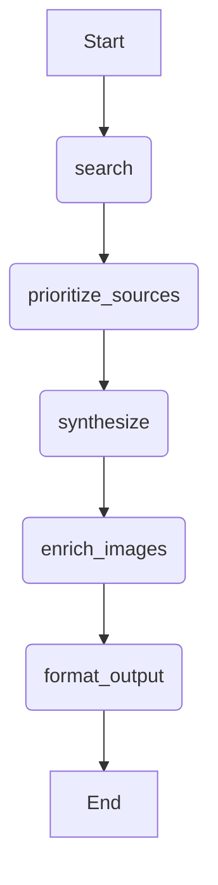

# 🧠 Perplexity MVP — System Design Document

## 1. 🎯 Project Overview

The **Perplexity MVP** is a lightweight, agentic Q&A backend designed to replicate the *core experience* of Perplexity.ai:

> **Natural-language search → LLM synthesis → Cited answer → Conversational continuity**

Our stack:

* **Backend:** FastAPI (Python)
* **Orchestration:** LangGraph
* **LLM:** OpenAI API
* **Web Search:** SERP API
* **Database:** None initially — conversational memory via LangGraph **checkpoints**
* **Frontend:** Next.js (planned)
* **Persistence:** File-based (pickled checkpoints + JSONL logs)

This MVP is designed for:

* Fast iteration in Cursor or local dev
* Simple end-to-end flow
* A testable foundation for later expansion (streaming, vector memory, multi-agent orchestration)

---

## 2. 🧱 High-Level Architecture

```mermaid
flowchart LR
  FE[Next.js Frontend]
  FE -->|POST /api/ask| API(FastAPI Backend)
  API --> AG[LangGraph Agent]
  AG --> S[search]
  S --> P[prioritize_sources]
  P --> Y[synthesize]
  Y --> I[enrich_images]
  I --> F[format_output]
  AG --> CK[(LangGraph Checkpoints)]
  AG --> LOG[[Progress Logs]]
  FE <-->|GET /api/progress/{session_id}| LOG
```

---

## 3. ⚙️ Environment Setup

### Virtual Environment

Use `venv` for clean dependency isolation:

```bash
python3 -m venv venv
source venv/bin/activate   # macOS/Linux
# or
venv\Scripts\activate      # Windows
```

### Install Dependencies

```bash
pip install fastapi uvicorn openai langgraph python-dotenv
pip freeze > requirements.txt
```

✅ **Verify Setup**

```bash
python -m fastapi --version
uvicorn --version
```

---

## 4. 🧩 Directory Structure

```
app/
  api/
    main.py                  # FastAPI app entrypoint
  agent/
    __init__.py
    state.py                 # Pydantic state models
    graph.py                 # LangGraph orchestration logic
    checkpoints.py           # Pickle-based checkpoint persistence
    logging.py               # Step-level progress logging
  data/
    checkpoints/
    logs/
docs/
  system_design.md
  agent.md                   # Detailed LangGraph design
requirements.txt
```

---

## 5. 🧠 LangGraph Design

### Graph Topology



### Rationale

| Node                 | Responsibility                               |
| -------------------- | -------------------------------------------- |
| `search`             | Calls SERP API, fetches titles/snippets/URLs |
| `prioritize_sources` | Uses LLM to rank sources by domain authority |
| `synthesize`         | Produces concise, cited answer (JSON output) |
| `enrich_images`      | Pulls OpenGraph images for each source       |
| `format_output`      | Normalizes JSON structure for API            |

### Memory

* Uses **LangGraph checkpoints** (`data/checkpoints/{session_id}.pkl`)
* Stores last state object (with history, results, citations)
* Enables multi-turn continuity without external DB

---

## 6. 🧱 AgentState Schema

```python
class AgentState(BaseModel):
    session_id: str
    query: str
    history: list[dict] = []  # from checkpoints
    results: list[SearchResult] | None = None
    ranked_results: list[SearchResult] | None = None
    answer: str | None = None
    citations: list[Citation] | None = None
```

### Data Classes

```python
class SearchResult(BaseModel):
    title: str
    url: str
    snippet: str
    domain: str

class Citation(BaseModel):
    id: int
    title: str
    url: str
    image: str | None = None
```

---

## 7. 🧰 Persistence & Logging

### 7.1 Checkpoints

* Saved as `pickle` files per `session_id`
* Used to rehydrate conversational context between requests
* Functions:

  ```python
  save_checkpoint(session_id, state)
  load_checkpoint(session_id) -> AgentState | None
  ```

### 7.2 AgentLogger

Each node logs its lifecycle (`start`, `end`, `error`) to `data/logs/{session_id}.jsonl`.

Example log event:

```json
{
  "timestamp": "2025-11-05T01:02:03Z",
  "step": "synthesize",
  "status": "start",
  "message": "Generating answer"
}
```

---

## 8. 🌐 FastAPI Design

### 8.1 Endpoints

| Method | Path                         | Description                    |
| ------ | ---------------------------- | ------------------------------ |
| `POST` | `/api/ask`                   | Run the LangGraph pipeline     |
| `GET`  | `/api/progress/{session_id}` | Return current progress events |
| `GET`  | `/health`                    | Simple readiness check         |

---

### 8.2 Request/Response Models

#### Request

```json
{
  "session_id": "123e4567",
  "query": "Who won the 2024 NBA Finals?"
}
```

#### Response

```json
{
  "session_id": "123e4567",
  "answer": "The Boston Celtics won the 2024 NBA Finals [1].",
  "sources": [
    {"title": "ESPN", "url": "https://espn.com", "image": "https://..."}
  ],
  "timestamp": "2025-11-05T00:00:00Z",
  "latency_ms": 2500
}
```

---

## 9. 🧪 Testing Plan (Progressive)

Testing is built into every stage.

### ✅ Step 1: Environment

* `python -m fastapi --version` succeeds
* Imports `fastapi`, `uvicorn`, `openai` without error

### ✅ Step 2: Checkpoints

```python
from app.agent.state import AgentState
from app.agent.checkpoints import save_checkpoint, load_checkpoint
s = AgentState(session_id="test", query="hello")
save_checkpoint("test", s)
assert load_checkpoint("test").query == "hello"
```

### ✅ Step 3: Logging

```python
from app.agent.logging import AgentLogger
log = AgentLogger("demo")
log.start("search"); log.end("search")
```

→ `data/logs/demo.jsonl` should contain two valid JSON lines.

### ✅ Step 4: Dummy Graph

```python
from app.agent.graph import invoke
from app.agent.state import AgentState
state = AgentState(session_id="demo", query="What is AI?")
print(invoke(state).answer)
```

### ✅ Step 5: FastAPI Endpoint

```bash
uvicorn app.api.main:app --reload
```

```bash
curl -X POST http://127.0.0.1:8000/api/ask \
  -H "Content-Type: application/json" \
  -d '{"query": "What is AI?"}'
```

→ Should return an `answer` and `sources` list.

### ✅ Edge Cases

| Case                                | Expected Behavior             |
| ----------------------------------- | ----------------------------- |
| Empty `query`                       | FastAPI 422 Validation Error  |
| Missing `session_id`                | Auto-generates UUID           |
| Repeated `session_id`               | Continues same conversation   |
| `/api/progress` nonexistent session | Returns `{"events":[]}`       |
| Concurrent requests                 | Separate checkpoint/log files |

---

## 10. 🔒 Reliability & Safety

* **Timeouts:** SERP/LLM calls capped at 10s
* **Retries:** Single retry per node allowed
* **Error resilience:** On failure, node logs `"error"` and returns gracefully
* **Thread safety:** Each session ID isolates its own checkpoint/log file
* **Security:** No external code execution or user file access

---

## 11. 🚀 Development Workflow

| Stage            | Command                                            | Expected                      |
| ---------------- | -------------------------------------------------- | ----------------------------- |
| 1️⃣ Setup        | `python3 -m venv venv && source venv/bin/activate` | Virtual environment ready     |
| 2️⃣ Install      | `pip install -r requirements.txt`                  | Dependencies installed        |
| 3️⃣ Run          | `uvicorn app.api.main:app --reload`                | API live on localhost:8000    |
| 4️⃣ Test         | `curl /api/ask`                                    | Returns valid JSON            |
| 5️⃣ Inspect Logs | `cat data/logs/*.jsonl`                            | Step-by-step progress visible |

---

## 12. 🧭 Future Roadmap

| Upgrade                          | Description                                    |
| -------------------------------- | ---------------------------------------------- |
| **Async streaming (SSE)**        | Real-time token streaming and progress updates |
| **SQLite session transcripts**   | Persist chat history for user dashboard        |
| **Parallel multi-engine search** | Query multiple SERP APIs in parallel           |
| **Postgres persistence**         | Replace pickles with SQL for multi-tenant use  |
| **Auth middleware**              | API key or JWT-based access                    |
| **Testing harness**              | Pytest-based coverage for all nodes            |

---

## 13. ✅ MVP Success Criteria

| Requirement                         | Verification                           |
| ----------------------------------- | -------------------------------------- |
| API handles single-turn Q&A         | Returns answer with citations          |
| Checkpoints persist across sessions | Same `session_id` → consistent history |
| Logs stream progress                | `/api/progress` updates in real time   |
| Local setup < 5 min                 | venv + install + run works immediately |
| Frontend-ready                      | JSON output predictable and parseable  |

---

## 14. 🧩 Appendix — Example Developer Session

**Goal:** Validate flow for user query “Who’s the best female rapper?”

1. **Frontend → POST /api/ask**

   ```json
   {"query": "Who’s the best female rapper?"}
   ```
2. **Logs show**

   ```
   [search.start] Searching...
   [prioritize_sources.start] Ranking domains...
   [synthesize.start] Generating concise answer...
   [enrich_images.start] Fetching thumbnails...
   [format_output.end] Done.
   ```
3. **Response**

   ```json
   {
     "answer": "According to Billboard and Genius, Nicki Minaj remains one of the top-rated female rappers in 2024 [1][2].",
     "sources": [
       {"title": "Billboard Best Female Rappers", "url": "https://billboard.com/..."},
       {"title": "Genius Rankings", "url": "https://genius.com/..."}
     ]
   }
   ```

---

